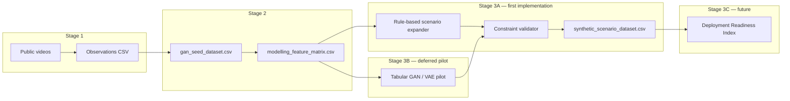

# Stage 3: Generative Augmentation Design

**Status:** Design complete (implementation not started)  
**Date:** 2026-06-28  
**Prerequisites:** Stage 1 approved · Stage 2 seed conversion complete (`seed_dataset_ready`)  
**Config:** [`config/generative_augmentation_config.yaml`](../config/generative_augmentation_config.yaml)

> **Scope of this document:** Architecture, constraints, and phased roadmap for synthetic scenario generation. **No GAN training or synthetic records are produced in the design phase.**

---

## 1. Purpose

Stage 3 extends the video-informed pipeline toward **GAN-augmented deployment readiness assessment** for construction robots in **Mivan / aluminium formwork high-rise** projects.

The goal is to generate **logically valid synthetic deployment scenarios** from the 14-record seed feature matrix, enabling:

- Broader scenario coverage than observational seeds alone  
- Stress-testing of access, congestion, and workflow-stage combinations  
- A future **Deployment Readiness Index (DRI)** framework (design only — not scored yet)

Synthetic scenarios must remain **secondary and non-productivity**: no cycle-time or field-performance claims.

---

## 2. Inputs and current constraints

| Input | Rows | Role |
|-------|------|------|
| `data/gan_seed_dataset.csv` | 14 | Primary generative conditioning set |
| `data/modelling_feature_matrix.csv` | 14 × 17 | Numeric/categorical feature vector (built by design script) |
| `config/generative_augmentation_config.yaml` | — | Feature spec, constraints, phases |
| `data/manufacturer_specs.csv` | 10 (E3) | **Reference only** — not GAN training labels |

**Binding limits (unchanged):**

1. Secondary observational provenance only  
2. No productivity / duration targets in generation  
3. M01/M05 and R07/R13 not double-counted (already excluded from seeds)  
4. BrightMaster-heavy sample + 1 Bright Dream comparator  

**Critical design constraint:** *n = 14 seeds is too small for standalone GAN training.* Stage 3 uses a **hybrid phased strategy**.

---

## 3. Recommended architecture



### Phase 3A — Constraint-guided scenario expansion (recommended first)

**Method:** Combinatorial perturbation of seed features within allowed ordinal/categorical bounds, filtered by construction-logic rules in `validate_scenario_constraints.py`.

| Parameter | Design value |
|-----------|--------------|
| Target synthetic count | 50 (initial pilot batch) |
| Generation method tag | `rule_expanded` |
| Human review | Required before paper use |

**Allowed perturbations (examples):**

- Congestion: low ↔ medium ↔ high (within same workflow stage family)  
- Access: open ↔ partially_restricted ↔ congested (with high-congestion warning flag)  
- Labour count: ±1–2 from seed value, bounded [2, 12] for Mivan rows  
- Robot operator count: 0–2 for robot rows  

**Not allowed:**

- Fresh-concrete robot on hardened surface  
- Post-cast coating on wet concrete  
- Rebar activity in pour/post-cast stage  
- Any duration or productivity field generation  

### Phase 3B — Tabular generative pilot (**complete**)

**Method:** CTGAN (primary) / TVAE (fallback) on `modelling_feature_matrix.csv` (n=14 training set).

| Parameter | Value |
|-----------|-------|
| Exported GAN scenarios | 50 |
| Combined with rule synthetics | 100 (`synthetic_scenario_dataset_all.csv`) |
| Generation method tag | `tabular_gan` or `tabular_vae` |
| Sign-off | [`phase3b_signoff.md`](phase3b_signoff.md) |

Post-generation outputs pass the same constraint validator as rule-expanded scenarios (0 hard errors in pilot export).

### Phase 3C — Deployment Readiness Index (**complete**)

DRI is a **weighted composite** over scenario features. See [`deployment_readiness_index_design.md`](deployment_readiness_index_design.md) and [`phase3c_signoff.md`](phase3c_signoff.md).

| Dimension | Example inputs (from feature matrix) |
|-----------|--------------------------------------|
| Work-zone access | `access_condition_enc`, `congestion_level_enc` |
| Workflow fit | `activity_group_enc`, `workflow_stage_enc` |
| Human–robot coexistence | `labour_count_visible`, `robot_operator_count` |
| Surface/task alignment | `operating_surface_enc`, activity-surface rules |
| Manufacturer stratum | `manufacturer_name_enc`, `comparison_robot_enc` |

Scores would be **scenario-relative** (ranking synthetic scenarios), not absolute field-validated performance. Independent site validation required before quantitative claims.

---

## 4. Feature vector specification

Built by `src/build_modelling_feature_matrix.py`:

| Column | Type | Source |
|--------|------|--------|
| `video_category_enc` | 0/1 | mivan / robot |
| `activity_group_enc` | 1–13 | taxonomy map in config |
| `workflow_stage_enc` | 1–3 | pre-pour / pour / post-cast |
| `movement_pattern_enc` | 0–4 | robot movement |
| `operating_surface_enc` | 0–3 | wet / pre-pour / hardened |
| `congestion_level_enc` | 1–3 | ordinal |
| `reinforcement_complexity_enc` | 0–3 | ordinal (Mivan) |
| `access_condition_enc` | 1–3 | ordinal |
| `safety_condition_enc` | 1–3 | ordinal |
| `evidence_level_enc` | 1–2 | E1/E2 (provenance trace) |
| `coding_confidence_enc` | 2–3 | medium/high seeds only |
| `manufacturer_name_enc` | 0–2 | BrightMaster / Bright Dream / none |
| `comparison_robot_enc` | 0/1 | comparison flag |
| `labour_count_visible` | int | 0 for robot-only rows |
| `robot_operator_count` | int | 0 for Mivan rows |

**Excluded from generation:** all duration fields, productivity flags, E3 spec values.

---

## 5. Scenario families

Four families defined in config for targeted augmentation:

| ID | Description | Seed filter |
|----|-------------|-------------|
| `SF-MIVAN-SLAB-CYCLE` | Slab-cycle labour/access scenarios | `video_category=mivan` |
| `SF-ROBOT-FRESH-CONCRETE` | Pour-stage leveling robots | `activity_group=fresh_concrete_leveling` |
| `SF-ROBOT-POST-CAST` | Grinding / coating robots | robot + post-cast |
| `SF-DEPLOYMENT-JOINT` | Paired Mivan + robot by workflow stage | cross-product by stage |

Joint scenarios pair one Mivan seed and one robot seed sharing compatible `workflow_stage_enc` (e.g. pour-stage Mivan pour + fresh-concrete leveling robot).

---

## 6. Synthetic output schema

Template: `data/templates/synthetic_scenario_dataset_template.csv`

Each synthetic record includes:

- `scenario_id` — SYN-001, …  
- `is_synthetic=yes` — always  
- `generation_method` — `rule_expanded` | `tabular_gan` | …  
- `source_seed_id` — lineage to seed(s)  
- `scenario_family` — SF-* ID  
- Feature columns (mirroring modelling matrix)  
- `logical_validity` — pass / fail  
- `constraint_violation_count` — integer  
- `synthetic_provenance` — audit tag  
- **No** `readiness_index_score` until Phase 3C validation  

---

## 7. Validation and evaluation (design targets)

| Metric | Target (Phase 3A pilot) |
|--------|-------------------------|
| Constraint violation rate | < 5% of generated rows |
| Activity–workflow coherence | 100% pass on hard rules |
| Manufacturer stratum preservation | Bright Dream ≥ 1 synthetic leveling scenario |
| Seed leakage | No exact duplicate of seed feature vector |
| Marginal distribution similarity | KS / chi-square vs seeds (report only, Phase 3B) |

Run baseline on seeds:

```bash
python src/validate_scenario_constraints.py
```

---

## 8. Implementation roadmap

| Step | Deliverable | Status |
|------|-------------|--------|
| 3.0 | This design doc + config + feature matrix | **Done** |
| 3.1 | `src/expand_scenarios.py` (rule-based expander) | Not started |
| 3.2 | `data/synthetic_scenario_dataset.csv` (pilot 50) | Not started |
| 3.3 | Human review gate + design sign-off | Pending |
| 3.4 | Tabular GAN pilot (optional) | Deferred |
| 3.5 | DRI scoring module | Deferred |

**Approval gate before 3.1:** Review this design document.

---

## 9. Research-safe statement (for paper)

> Synthetic deployment scenarios were designed to augment a small seed set derived from secondary video observations. Generative augmentation preserves construction-logic constraints and excludes productivity timing. Synthetic records are labelled `is_synthetic=yes` and require independent validation before any quantitative deployment-readiness claims.

---

## 10. Related files

| File | Purpose |
|------|---------|
| [`stage3_design_checklist.md`](stage3_design_checklist.md) | Approval gates |
| [`gan_seed_conversion_algorithm.md`](gan_seed_conversion_algorithm.md) | Stage 2 input |
| [`paper_methods_draft.md`](paper_methods_draft.md) | Methods section (Stage 3 subsection added) |
| `scripts/complete_stage3_design.py` | Build matrix + constraint baseline |

---

## 11. What Stage 3 design does NOT include

- GAN / VAE model training  
- Synthetic CSV output (`synthetic_scenario_dataset.csv` empty until Phase 3.1)  
- Deployment Readiness Index numeric scores  
- Field validation or productivity claims  
